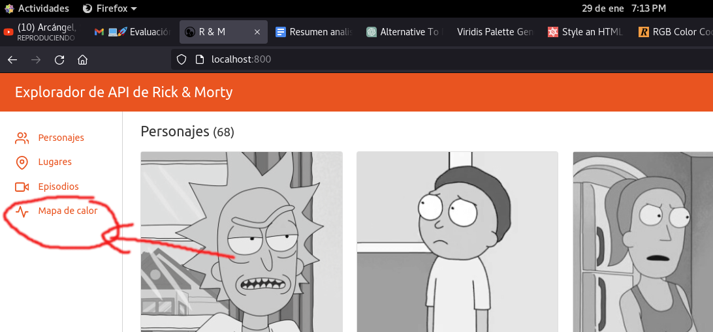
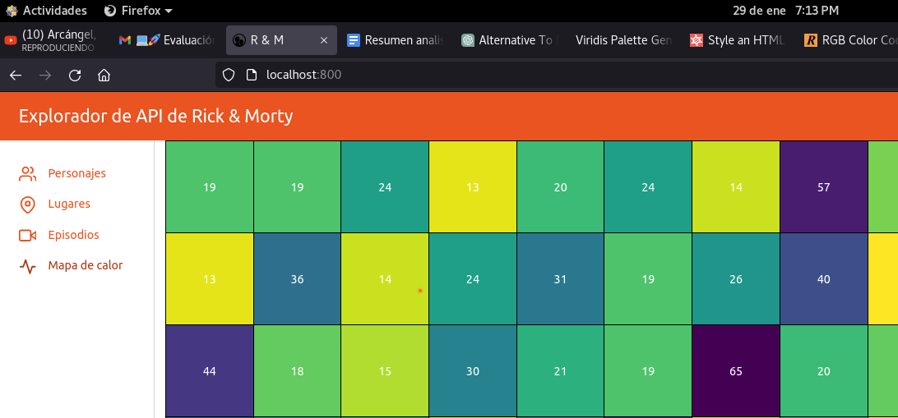

# Prueba tecnica FRONTEND, para Carryt.co

## Instrucciones de instalacion y despliegue
Dockerice el proyecto para evitar confusiones con el uso de versiones y facilitar el despliegue y ejecucion del proyecto, se incluyeron los siguiente archivos:
* docker-compose.yml
* entrypoint.sh
* Dockerfile

### Requisitos tecnicos e instalacion 
Se requiere tener instalado docker y docker-compose, yo recomiendo hacerlo en una maquina con linux instalado, puede ser ubuntu 
* clonar repositorio **git clone https://github.com/whohe/technical-frontend-test-carryt.co.git**
* ejecute **docker-compose up -d** e ingrese a la url http://localhost:800/
    
   Si es la primera vez que ejecuta el servicio, puede tomarse unos minutos en instalarse las dependencia y levantar el servidor web, para ver el detalle pruebe ejecutando docker-compose up 
*
### Pantallas

